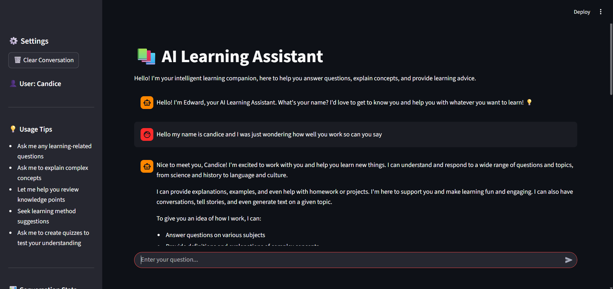
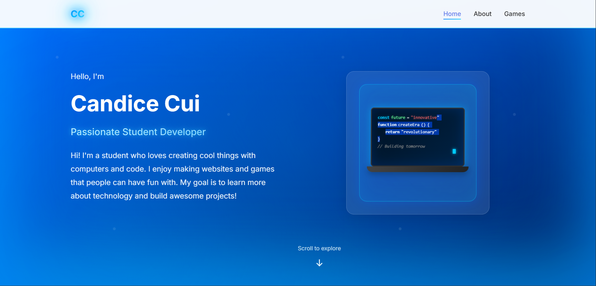

# Candice's Projects Portfolio 🚀

A showcase of my web development and AI projects, featuring an AI-powered study companion and my personal portfolio website.

## Projects Overview

This repository showcases two main projects by Candice Cui:

### 1. AI Chat Assistant - Study Buddy 📚
A personalized AI-powered study companion built with Streamlit and powered by Groq's Llama 3.3 70B model. This intelligent chatbot helps students learn more effectively through interactive conversations, explanations, and study support. The assistant maintains conversation context, adapts to your learning style, and provides detailed explanations tailored to your needs.

### 2. Personal Portfolio Website 💼
A professional portfolio website showcasing my work as a Passionate Student Developer. Built with HTML5, CSS3, and JavaScript, featuring a clean, modern design with interactive elements and responsive layouts.

## Features

### AI Chat Assistant Features
- 💬 **Interactive Conversations** - Natural, context-aware conversations that feel like talking to a real tutor
- 🧠 **Intelligent Learning Support** - Get explanations, examples, and step-by-step guidance on various topics
- 📝 **Conversation Memory** - The chatbot remembers your conversation history for coherent, contextual responses
- ⚡ **Fast Response Time** - Powered by Groq's lightning-fast inference for near-instant answers
- 🔒 **Secure API Integration** - Safe handling of API keys through environment variables

### Portfolio Website Features
- 🎨 **Modern Design** - Clean, professional interface with smooth animations
- 📱 **Responsive Layout** - Works perfectly on desktop, tablet, and mobile devices
- 💻 **Interactive Code Display** - Showcases coding skills with animated code snippets
- 🎮 **Project Showcase** - Highlights games and web applications I've built

## Technologies Used

### AI Chat Assistant
- **Python 3.9+** - Core programming language
- **Streamlit** - Web application framework for the user interface
- **Groq API** - AI inference platform
- **Llama 3.3 70B** - Advanced large language model
- **python-dotenv** - Environment variable management

### Portfolio Website
- **HTML5** - Structure and content
- **CSS3** - Styling and animations
- **JavaScript** - Interactive functionality
- **Git** - Version control

## How to Run Locally

### Prerequisites
- Python 3.9 or higher
- A Groq API key (see [API Key Setup](#api-key-setup) section)

### Step 1: Clone the Repository
```bash
git clone https://github.com/Candice/ai-chatbox.git
cd ai-chatbox
```

### Step 2: Install Dependencies
```bash
pip install -r requirements.txt
```

### Step 3: Configure Environment Variables
Create a `.env` file in the project root directory:
```bash
# .env
GROQ_API_KEY=your_groq_api_key_here
```

Replace `your_groq_api_key_here` with your actual Groq API key.

### Step 4: Run the Application
```bash
streamlit run app.py
```

The application will open in your default browser at `http://localhost:8501`.

## Deployment

### Deploy to Streamlit Cloud

1. **Fork or push this repository to your GitHub account**

2. **Go to [Streamlit Cloud](https://streamlit.io/cloud)**

3. **Click "New app" and select your repository**

4. **Configure your app:**
   - Repository: `Candice/ai-chatbox`
   - Branch: `main`
   - Main file path: `app.py`

5. **Add your secrets:**
   - Go to "Advanced settings" → "Secrets"
   - Add your environment variables:
     ```toml
     GROQ_API_KEY = "your_groq_api_key_here"
     ```

6. **Click "Deploy"** and wait for your app to launch!

## Live Demos

### AI Chat Assistant
🌐 **[Try the AI Study Buddy](your-streamlit-link)**

### Portfolio Website
🌐 **[View Portfolio Website](https://Candicegithub.io/profile-website)**

## Screenshots

### AI Chat Assistant

*AI Learning Assistant chat interface showing personalized learning support with Edward*

### Portfolio Website

*Personal portfolio website homepage showcasing Candice Cui as a Passionate Student Developer*

## API Key Setup

### Getting Your Groq API Key

1. Visit [Groq Console](https://console.groq.com/)
2. Sign up or log in to your account
3. Navigate to the API Keys section
4. Click "Create API Key"
5. Copy your API key and save it securely
6. Add it to your `.env` file or Streamlit Cloud secrets

**Important:** Never commit your API key to version control. Always use environment variables or secrets management.

## Future Improvements

- [ ] Add support for multiple AI models (GPT-4, Claude, etc.)
- [ ] Implement conversation export functionality (PDF, TXT)
- [ ] Add subject-specific study modes (Math, Science, Languages)
- [ ] Include voice input/output capabilities
- [ ] Create flashcard generation from conversations
- [ ] Add multilingual support
- [ ] Implement user accounts and conversation history storage
- [ ] Add code execution environment for programming help

## Author

**Candice**

- GitHub: [@Candice](https://github.com/Candice)
- Project Repository: [ai-chatbox](https://github.com/Candice/ai-chatbox)

---

### License

This project is open source and available under the [MIT License](LICENSE).

### Contributing

Contributions, issues, and feature requests are welcome! Feel free to check the [issues page](https://github.com/Candice/ai-chatbox/issues).

---

Made with ❤️ for students everywhere
